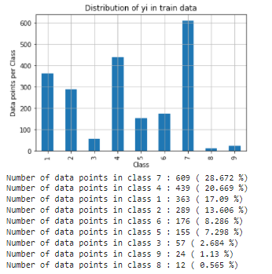
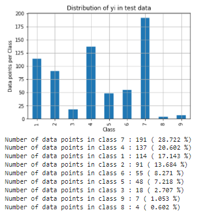
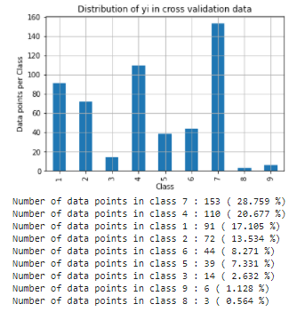
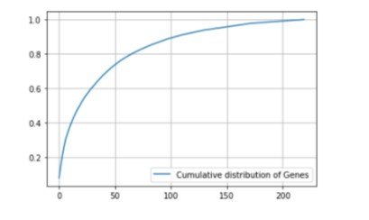
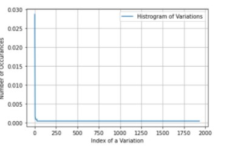
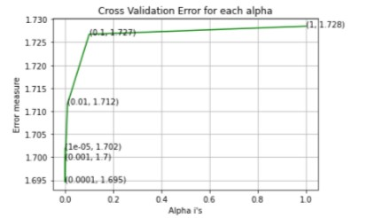
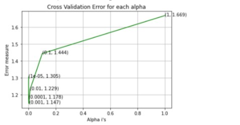
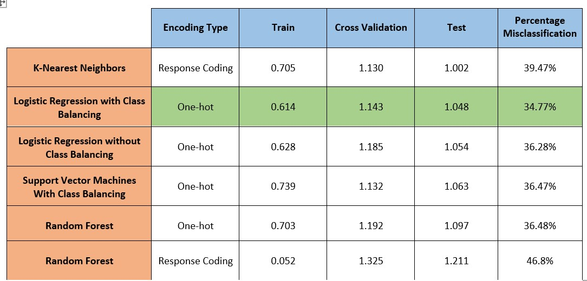

# cancer-prediction-from-Gene-Data

## Problem Definitions:
 
once a patient seems to have some problem, the first thing the doctors does is they take the cancer tumor from the patient,and they do genetic sequencing on it which gives the Gene.These genes mutate. Mutations on genes are basically small changes in the gene, which can corrupt the genetic code.A mutated Gene might casue cancer. There is a lot of mutual effort by a clinical pathologist who actually take a list of genetic variations that are of interest that they think that we should start analyzing for potential signals of cancer and search for evidance in the Medical literature,they spend huge amount of time on this.The whole purpose of machine learning in this context for this problem is to speed up analyzing this research that has been collected to determine which of the classes it belongs to.

## Central Dogma of molecular biology

Nucleotides from the DNA are transcribed. They're complementary forms on RNA, which are then read as codons or groups of three to code for specific amino acids and a larger protein.Now, if you mutate one of the nucleotides on DNA that ultimately lead to abnormal protein production which may lead to cancer. 

 
 
 ## Problem Statement: 
 
classify a genetic variation or a mutation, based on evidence from text placed clinical research.
 
So we want to classify given a gene and a variation and some text corresponding to this gene and variation,this text is basically all the literature survey or all the research which has been done on this gene and variation that the domain expert has collected.We want to use this text to determine which of the classes does this gene and variation fall into. 

## Business objectives and constraints.

 - No low-latency requirement.  
 - Interpretability is important.  
 - Errors can be very costly. 
 - Probability of a data-point belonging to each class is needed. 
  
## Data Overview:

Data sourcce:Memorial Sloan Kettering Cancer Center (MSKCC)

We have two data files: one conatins the information about the genetic mutations and the other contains the clinical evidence (text) that human experts/pathologists use to classify the genetic mutations.Both these data files have a common column called ID.

Data file's information:  
variants (ID , Gene, Variations, Class)  
text (ID, Text)  

## Mapping the real-world problem to an ML problem

### Type of Machine Learning Problem

There are nine different classes a genetic mutation can be classified into => Multi Class Classification Problem

### Performance Metric

- Multi Class log-loss: To penalise the errors in class probabilities.
- Confusion matrix

## Objective
Predict the probability of each data-point belonging to each of the nine classes.

## Train,CV and Test Datasets

split the data into three parts train,cross validation and test with 64%,16%,20% of data respectively.

## Exploratory data analysis

  
   
  

#### Takeaway from the above visualizations:
We are operating on multi class classification problem and the data is imbalanced. 
The Train,Test and Cross Validation data have similar distribution of the class label Y. 

## Univariate analysis on Gene Feature 

  
   

#### Best Hyperparameter

#### Conclusion:

The Logloss for the Gene Feature is less than the Random model and the Gene Feature is stable because the CV and Test erroes are almost near to the Train error,there is significant difference between them.

## Univariate analysis on Gene Variation

  
   

#### Best Hyperparameter for Gene Variation

#### Conclusion:

Even Gene Variation feature is important because the log less is less when compared to Random model but Gene Variation is less stable becuase when compared to Gene feature.

## Univariate analysis on Text Feature 

#### Best Hyperparameter for  Text Feature 

#### Conclusion:

The text feature is the most important feature because the log loss is less for all the train,Test and CV data.

# Machine learning Models

- K-Nearest Neighbors
- Logistic Regression with ClassBalancing
- Logistic Regression without Class Balancing 
- Support Vector Machines With Class Balancing 
- Random Forest with one hot encoding 
- Random Forest with response coding 

## Analysis summary

## Conclusion:

From our analysis, for Gene data and the type of variation the best model is Hyperparameter tuned Logistic Regression model with log-loss of 1.048 on Test split. Reduced the misclassification rate to 34.77%. The performance metric log-loss needs to be minimized, so the closer it to zero the better. If we need to find the best model, then Logistic regression is the best. For future scope, we can try building all the same models with TF-IDF features relacing the countVectorizer and insted of Using all words in the text data using only  top 1000 words based on TF-IDF values and Including both Unigrams and Bigrams and try other feature engineering techniques to resduce the test-logloss to zero.

## Learnings

This was an interesting project as I got an opportunity to work on a  imbalanced dataset . I have also learnt advanced feature engineering techniques like resampling imbalanced data, creating new features, handling missing values etc. I have experimented with various ML algorithms like K-Nearest Neighbour,Logistic Regression with Class balancing,Logistic Regression without class balnce,SVM with class balancing, Random Forest with One-hot encoding,Random Forest with Response encoding with Hyperparameters Tuning etc. out of which the best performing model was the Logistic Regression model (With the lowest Log-Loss and Misclassification rate). I have also got to build some very complex confusion matrix which took a while for me to make sense of. In the business context, the Misclassication rate and  can be improved further by applying more advanced features extraction and data pre-processing techniques and trying out other hyperparameter tuned models.

